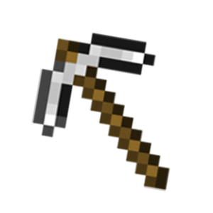

<h2>Hi there, I'm Christopher! </h2>

<h3> About Me</h3>

-  🎩 Associate Software Engineer @ Red Hat working on OpenShift GitOps
-  ☁️ Interested in Containers, Cloud Native Infastructure, Distributed Systems, and Networking
-  🎮 JRPG & Fighting Game fanatic (Favorite Game: Trails into Reverie)
-  🐧 I spend way too long customizing my Linux machines

 

<h3> Technologies & Skills</h3>

- **Programming & Scripting:** Golang, Python, C++, C, Javascript/Typescript, Bash, YAML, JSON
- **Cloud Native & DevOps:** Kubernetes, Argo CD, Helm, Kustomize, Containerization, Bootc, AWS, Terraform
- **Frameworks & Libraries:** React, Next.js, Tailwind CSS, SQLite, Pandas, Matplotlib, Pyserial
- **Development Tools & Practices:** Git, Jira, Agile/Scrum, GitOps Principles, Unit Testing, LaTex

### "Code breaks -> I'm the worst to ever do it -> Code works -> I'm the greatest to ever do it" 

<!---
cjcocokrisp/cjcocokrisp is a ✨ special ✨ repository because its `README.md` (this file) appears on your GitHub profile.
You can click the Preview link to take a look at your changes.
--->
